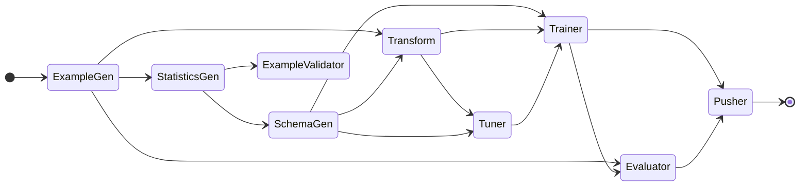

# TFX Pipelines

This is a TFX example pipeline.

---

Folder structure
```shell
.
├── data/                          # Data folder
├── notebooks/                     # Example TFX notebooks
├── outputs/                       # Local runs outputs folder
├── schema/                        # Custom defined schema
├── src/
│   ├── data
│   │   └── data.csv               # Source data
│   ├── models/                    # Directory of ML model definitions
│   │   ├── estimator_model/
│   │   │   ├── constants.py       # Defines constants of the model
│   │   │   ├── model_test.py      # Model test file
│   │   │   └── model.py           # DNN model using TF estimator
│   │   ├── keras_model/
│   │   │   ├── constants.py       # Defines constants of the model
│   │   │   ├── model_test.py      # Model test file
│   │   │   └── model.py           # DNN model using Keras
│   │   ├── features_test.py
│   │   ├── features.py
│   │   ├── preprocessing_test.py  # Preprocessing test file
│   │   └── preprocessing.py       # Defines preprocessing job using TF Transform
│   ├── pipeline/                  # Directory of pipeline definition
│   │   ├── configs.py             # Defines common constants for pipeline runners
│   │   └── pipeline.py            # Defines TFX components and a pipeline
│   ├── utils/                     # Directory of utils/helper functions
│   ├── data_validation.ipynb      # Data validation notebook
│   ├── local_runner.py            # Runner for local orchestration
│   └── model_analysis.ipynb       # Model analysis notebook
├── .dockerignore
├── .gitignore
├── Dockerfile
├── requirements.in                # Environment requirements
├── requirements.txt               # Compiled requirements
└── README.md
```

There are some files with `_test.py` in their name. These are unit tests of the pipeline and it is recommended to add more unit tests as you implement your own pipelines. You can run unit tests by supplying the module name of test files with `-m` flag. You can usually get a module name by deleting `.py` extension and replacing `/` with `.`. For example:

```shell
# cd into src folder
$ cd src

# Run test file
$ python -m models.features_test
```

---

## Set up environment

This pipeline is running on Python 3.8.10. In order to create an environment to run locally follow these steps:

```shell
# Make sure you have the right Python activated

# Create virtual environment
$ python -m venv .venv

# Upgrade pip
$ .venv/bin/pip install --upgrade pip

# Install requirements
$ .venv/bin/pip install -r requirements.txt

# Activate environment
$ source .venv/bin/activate
```

This should spin up your local environment and you should be good-to-go running the pipeline and notebook scripts locally.

### Update environment
In case you need to update any requirements (e.g. update a package version or add new packages) do the following steps:
```shell
# Delete virtual environment (to make sure all old dependencies are removed)

# Make sure you have activated the right Python version and have pip-tools installed

# Update src/requirements.in with new package versions/added packages

# Compile requirements
$ pip-compile requirements.in

# Redo steps in section `Set up environment`
```

---

## Run pipeline locally (python CLI)

When you want to run the pipeline using the `local_runner.py` script, simply run:
```shell
$ python src/local_runner.py
```

---

## Run pipeline with Docker

### Build the image

Build the image using the `docker build` command:

```shell
$ docker build -t tfx-pipeline:latest .
```

### Run the container

Now that the image has been successfully built it is time to run a container out of it. You can do so by using the following command:

```shell
$ docker run -it \
$   -v $PWD/test_dir/data/:/app/data/ \
$   --rm tfx-pipeline:latest
```

---

## Conceptual pipeline flow


```mermaid
flowchart LR
    A(ExampleGen) --> B(StatisticsGen)
    B --> C(SchemaGen)
    B --> D(ExampleValidator)
    A --> E(Transform)
    C --> E(Transform)
    E --> F(Tuner)
    C --> F(Tuner)
    C --> G(Trainer)
    E --> G(Trainer)
    F --> G(Trainer)
    A --> H(Evaluator)
    G --> H(Evaluator)
    G --> I(Pusher)
    H --> I(Pusher)
    
